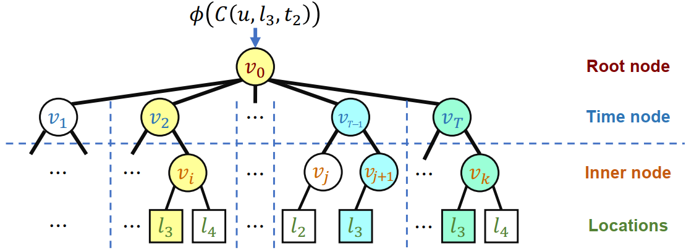

# TALE

TKDE. Pre-training Time-Aware Location Embeddings from Spatial-Temporal Trajectories.

# Requirements

- python >= 3.7
- pytorch == 1.6.0
- scikit-learn
- numpy == 1.19.1
- pandas == 1.1.2
- tables